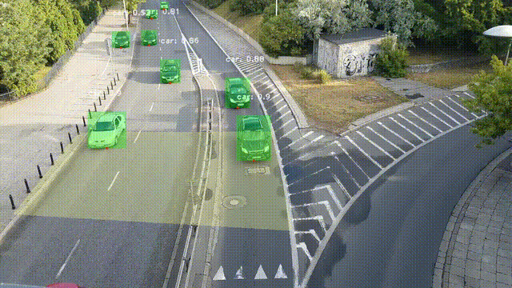

# Speed Violation Tracker
End-to-end computer vision pipeline for vehicle speed violator detection from videos and livestreams

## Demo

## QUICKSTART
### 1) Install
```bash
git clone https://github.com/HYSK-cmd/SpeedViolaterDetector.git
python -m venv .venv

For MAC USER:
source .venv/bin/activate

For WINDOW USER:
.venv/Script/Activate.ps1

pip install -r requirements.txt
```
## 2) Run with default config
### Run video
```bash
python ./script.py --source video --source_path path/to/video.mp4 --output_video *.mp4 --model '*.pt'
```
### Run livestream
```bash
flask run
python ./script.py --source livestream --output_video *.mp4 --model '*.pt'
```
## 3) Project Structure
```
Computer_Vision/
├───assets/
│   └───videos/
│       └───*.mp4
├───config/
│   ├───__init__.py
│   ├───loader.py
│   └───settings.yaml
├───docs/
│   ├───general_docs.md
│   ├───hardware_docs.md
│   ├───hardware_docs.md
│   └───structure.md
├───logs/
│   └───logs
│   └───speeding_cars
│       └───"%Y-%m-%d"
│            └───"%Y-%m-%d_%H-%M-%S"
│                 ├─── video
│                 │   └─── *.mp4, *.webm 
│                 ├─── *.png/jpg/jpeg
│                 └─── *.log
├───src/
│   ├───web/
│   │   ├───__init__.py
│   │   ├───routes.py
│   │   └───services.py
│   ├───__init__.py
│   ├───livestream_speed_detector.py
│   ├───pipeline.py
│   ├───utils.py
│   └───video_speed_detector.py
├───static/
│   ├───css/
│   │   └───style.css
│   └───js/
│       └───main.js
├───templates/
│   └───index.html
├───Yolo-Models/
│   └───*.pt
├───.gitignore
├───app.py
├───requirements.txt
└───script.py
```